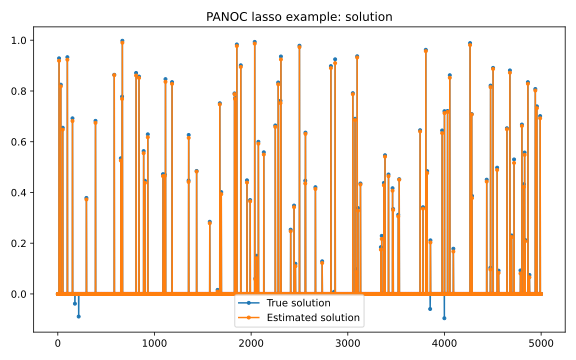

.. _lasso jax example:

Lasso JAX
=========

In this example, we use the PANOC solver to solve a lasso problem, i.e. least
squares with :math:`\ell_1`-regularization to promote sparsity.
Additionally, we impose a positivity constraint on the solution.

The `JAX <https://github.com/google/jax#installation>`_ package is used to
compute gradients. 

.. literalinclude:: ../../../../examples/Python/simple_optimization/lasso-jax.py
    :language: python
    :linenos:
