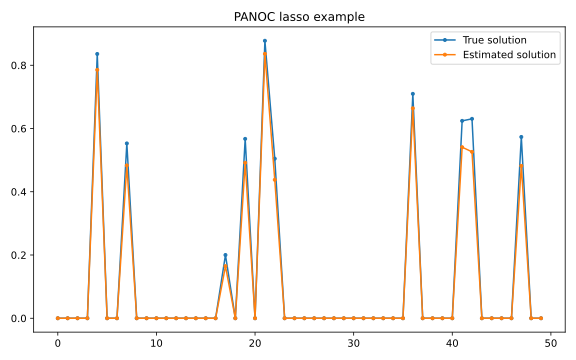

.. _lasso example:

Lasso
=====

In this example, we use the PANOC solver to solve a lasso problem, i.e. least
squares with :math:`\ell_1`-regularization to promote sparsity.

.. literalinclude:: ../../../../examples/Python/simple_optimization/lasso.py
    :language: python
    :linenos:
