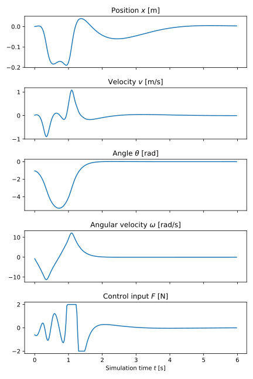

Inverted Pendulum
=================

In this example, a mode predictive controller (MPC) is used to stabilize an
inverted pendulum mounted on a moving cart.

.. raw:: html
   :file: ../../sphinxstatic/inverted-pendulum.html

.. raw:: html

    

   Plot of the states and the control signal of the MPC solution.

.. literalinclude:: ../../../../../examples/Python/mpc/inverted-pendulum-mpc.py
    :language: python
    :linenos:
