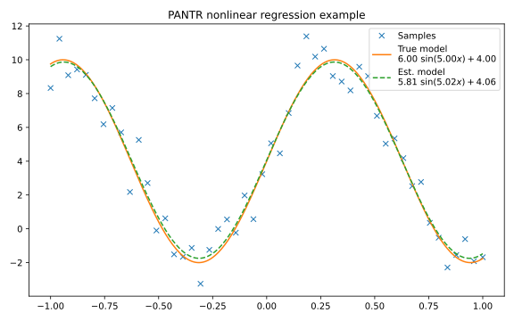

.. _nonlinear regression example:

Nonlinear regression
====================

In this example, we use the PANTR solver to fit a nonlinear model to some noisy
data. The model is given by :math:`y = p_1\ \sin(p_2 x) + p_3`, and the goal is
to estimate the parameters :math:`p_1`, :math:`p_2` and :math:`p_3` by
minimizing the squared error between the model and the data.

.. literalinclude:: ../../../../examples/Python/simple_optimization/nonlinear-regression.py
    :language: python
    :linenos:
