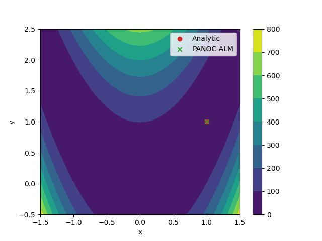

Minimal example 
=================
.. include:: ../shared/definitions.rst

In this simple example, we will show how to build and solve a basic optimization problem with |pylib_name|. 
The problem we will tackle is the following 

.. math::
    \begin{aligned}
        &\min_{x,y} &&  (1 - x)^2 + p  (y -x^2)^2 \\ 
        &\text{s.t.} && (x-1)^3 - y + 1 \leq 0 \\ 
        &            && x + y - 2 \leq 0 \\
        &           && 1.5 \leq x \leq 1.5  \\ 
        &           && -0.5 \leq y \leq 2.5 
    \end{aligned}

We start by importing necessary libraries.::

    import numpy as np
    import time
    import matplotlib.pyplot as plt
    from datetime import timedelta
    import os
    import sys

    sys.path.append(os.path.dirname(__file__))

We now build the optimization problem for |cpp_name| to solve::

    name = "minimal_example"

    # Make decision variables 
    x = cs.SX.sym("x")
    y = cs.SX.sym("y")

    # Make a parameter symbol 
    p = cs.SX.sym("p")

    cost = (1 - x)**2 + p * (y -x**2)**2  # Rosenbrock function (parametrized by p) 

    constraint_g_cubic = (x-1)**3 - y + 1
    constraint_g_linear = x + y - 2

    # Collect decision variables into one vector 
    X = cs.vertcat(x,y)

    cost_function = cs.Function("f", [X, p], [cost])
    g = cs.vertcat(constraint_g_cubic, constraint_g_linear)
    g_function = cs.Function("g", [X, p], [g])

Note that this is purely `CasADi <https://web.casadi.org/>`_ code, so thus far, everything we've done is independent of |pylib_name|. We now use the |casadi| objects to build C-code of the cost and constraints for |cpp_name| to optimize::

    import panocpy as pa
    from tempfile import TemporaryDirectory

    cgen, n, m, num_p = pa.generate_casadi_problem(name, cost_function, g_function)
    # Code generator, dimension of decision variables, number of constraints (dual dimension), parameter dimension 

    # Compile and load the problem, and set the bounds 
    prob = compile_and_load_problem(cgen, n, m, name)

The resulting object `prob` is an instance of :py:class:`panocpy._panocpy.Problem`. Before 
we can solve the problem, we need to set a few numerical values to the 
constraint bounds of this problem:: 

    prob.C.lowerbound = np.array([-1.5, -0.5])  # -1.5 <= x <= 1.5 
    prob.C.upperbound = np.array([ 1.5,  2.5])  # -0.5 <= y <= 2.5
    prob.D.lowerbound = np.array([-np.inf, -np.inf])  # g_c <= 0 
    prob.D.upperbound = np.array([0, 0])              # g_l <= 0

Next, we give the parameter :math:`p` some value::

    prob.param = np.array([100.])

Finally, we construct the solver for our problem. We start with an inner solver that then gets passed to an outer ALM solver:: 

    #%% Construct a PANOC instance to serve as the inner solver (with default parameters) 

    innersolver = pa.PANOCSolver(pa.PANOCParams(), pa.LBFGSParams())

    #%% Make an ALM solver with default parameters 

    almparams = pa.ALMParams()
    solver = pa.ALMSolver(almparams, innersolver)

We set some initial guesses for the problem and run the optimization:: 

    # set initial guesses at arbitrary values 
    x_sol = np.array([1., 2.]) 
    y_sol = np.zeros((m,))

    x_sol, y_sol, stats = solver(prob, x_sol, y_sol)

Finally, we print and plot the resulting solution to verify correctness of our script::

    print(stats["status"])

    print(f"Obtained solution: {x_sol}")
    # print(f"IPOPT solution: {x_ipopt}")
    print(f"Analytical solution: {(1., 1.)}")

    import matplotlib.pyplot as plt 

    x = np.linspace(-1.5, 1.5, 200)
    y = np.linspace(-0.5, 2.5, 200)
    X,Y = np.meshgrid(x,y)
    Z = (1 - X)**2 + 100 * (Y - X**2)**2 

    plt.figure() 

    plt.contourf(X,Y,Z) 
    plt.colorbar()
    plt.xlabel("x")
    plt.ylabel("y")
    plt.scatter(1, 1, color="tab:red", label="Analytic")
    plt.scatter(x_sol[0], x_sol[1], marker="x", color="tab:green", label="PANOC-ALM")
    # x_ipopt = x_ipopt.toarray()
    # plt.scatter(x_ipopt[0,0], x_ipopt[1,0], marker="x", color="tab:blue", label="IPOPT")
    plt.legend()
    plt.show()

