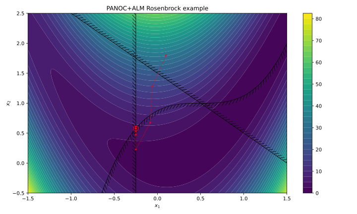

Getting started
===================================

The solver in this library can solve minimization problems of the following form:

.. math::
    \newcommand\mymathbb[1]
    { {\rm I\mathchoice{\hspace{-2pt}}{\hspace{-2pt}}
        {\hspace{-1.75pt}}{\hspace{-1.7pt}}#1} }
    \newcommand{\Re}{\mymathbb R}
    \begin{aligned}
        & \underset{x}{\text{minimize}}
        & & f(x) &&&& f : \Re^n \rightarrow \Re \\
        & \text{subject to}
        & & \underline{x} \le \phantom{g(}x\phantom{)} \le \overline{x} \\
        &&& \underline{z} \le g(x) \le \overline{z} &&&& g : \Re^n \rightarrow \Re^m
    \end{aligned}

The objective function :math:`f(x)` and the constraints function :math:`g(x)`
should have a Lipschitz-continuous gradient.

The two types of constraints are 
handled differently: the box constraints on :math:`x` are taken into account 
directly, while the general constraints :math:`g(x)` are relaxed using 
an Augmented Lagrangian Method (ALM). Whenever possible, try to express your 
constraints as box constraints on :math:`x`.

Equality constraints can be expressed by setting
:math:`\underline{z}_i = \overline{z}_i`.

For ease of notation, the box constraints on :math:`x` and :math:`g(x)`
are represented as the inclusion in rectangular sets :math:`C` and :math:`D`
respectively:

.. math::
    \begin{aligned}
        & \underset{x}{\text{minimize}}
        & & f(x) \\
        & \text{subject to}
        & & \phantom{g(}x\phantom{)} \in C \\
        &&& g(x) \in D
    \end{aligned}

Simple example
--------------

Consider the following simple two-dimensional problem, with the 
Rosenbrock function (parametrized by :math:`p`) as the cost function:

.. math::
    \begin{aligned}
        & \underset{x_1,x_2}{\text{minimize}}
        & & (1 - x_1)^2 + p\,(x_2 - x_1^2)^2 \\
        & \text{subject to}
        & & -0.25 \le x_1 \le 1.5 \\
        &&& -0.5 \le x_2 \le 2.5 \\
        &&& (x_1 - 0.5)^3 - x_2 + 1 \;\le 0 \\
        &&& x_1 + x_2 - 1.5 \;\le 0 \\
    \end{aligned}

In other words,

.. math::
    \begin{aligned}
        f(x) &= (1 - x_1)^2 + p\,(x_2 - x_1^2)^2 \\
        g(x) &= \begin{pmatrix}
            (x_1 - 0.5)^3 - x_2 + 1 \\
            x_1 + x_2 - 1.5
        \end{pmatrix} \\
        C &= [-0.25, 1.5] \times [-0.5, 2.5] \\
        D &= [-\infty, 0] \times [-\infty, 0]
    \end{aligned}

Problem description
^^^^^^^^^^^^^^^^^^^

The objective function and the constraints are defined as 
`CasADi <https://web.casadi.org/>`_ expressions with symbolic variables, and
then converted into CasADi functions. The arguments of these functions are the
decision variables and an optional parameter vector.

.. testcode::

    # %% Build the problem for PANOC+ALM (CasADi code, independent of panocpy)
    import casadi as cs

    # Make symbolic decision variables
    x1, x2 = cs.SX.sym("x1"), cs.SX.sym("x2")
    # Make a parameter symbol
    p = cs.SX.sym("p")

    # Expressions for the objective function f and the constraints g
    f_expr = (1 - x1) ** 2 + p * (x2 - x1 ** 2) ** 2
    g_expr = cs.vertcat(
        (x1 - 0.5) ** 3 - x2 + 1, 
        x1 + x2 - 1.5,
    )

    # Collect decision variables into one vector
    x = cs.vertcat(x1, x2)
    # Convert the symbolic expressions to CasADi functions
    f = cs.Function("f", [x, p], [f_expr])
    g = cs.Function("g", [x, p], [g_expr])

Next, the gradients of the functions are computed using CasADi, and they are 
compiled as efficient C functions. All of this happens inside of the 
:py:func:`panocpy.casadi_problem.generate_and_compile_casadi_problem`
function, which returns an instance of :py:class:`panocpy._panocpy.Problem`
or :py:class:`panocpy._panocpy.ProblemWithParam`, depending on whether the 
provided functions accept a parameter vector.

.. testcode::

    # %% Generate and compile C-code for the objective and constraints using panocpy
    import panocpy as pa

    # Compile and load the problem
    prob = pa.generate_and_compile_casadi_problem(f, g)

The bounds for the constraints can be initialized using lists or NumPy arrays:

.. testcode::

    # Set the bounds
    import numpy as np
    prob.C.lowerbound = [-0.25, -0.5]       # -0.25 <= x1 <= 1.5
    prob.C.upperbound = [1.5, 2.5]          # -0.5  <= x2 <= 2.5
    prob.D.lowerbound = [-np.inf, -np.inf]  # g1 <= 0
    prob.D.upperbound = [0, 0]              # g2 <= 0

.. note::

    These lower and upper bounds are immutable, so for example assigning single
    elements is not possible, but you can assign the entire vector, as shown in 
    the snippet above.

Finally, the parameter :math:`p` is given a value, completing the problem 
definition. This value can be changed later.

.. testcode::

    prob.param = [100.]

Selecting a solver
^^^^^^^^^^^^^^^^^^

The solvers in this package consist of an inner solver that can handle box 
constraints, such as `PANOC <https://arxiv.org/abs/1709.06487>`_,
and an outer ALM solver that relaxes the general constraints :math:`g(x) \in D`.
Solvers can be composed easily, for instance:

.. testcode::

    # %% Build a solver with the default parameters
    inner_solver = pa.StructuredPANOCLBFGSSolver()
    solver = pa.ALMSolver(inner_solver)

Each solver has its own set of optional parameters that can be specified using 
keyword arguments, for example:

.. testcode::

    # %% Build a solver with custom parameters
    inner_solver = pa.StructuredPANOCLBFGSSolver(
        panoc_params={
            'max_iter': 1000,
            'stop_crit': pa.PANOCStopCrit.ApproxKKT,
        },
        lbfgs_params={
            'memory': 10,
        },
    )

    solver = pa.ALMSolver(
        alm_params={
            'ε': 1e-10,
            'δ': 1e-10,
            'Σ_0': 0,
            'σ_0': 2,
            'Δ': 20,
        },
        inner_solver=inner_solver
    )

For a full overview and description of all parameters, see the documentation 
for :cpp:class:`pa::StructuredPANOCLBFGSParams` and :cpp:class:`pa::ALMParams`.

Solving the problem
^^^^^^^^^^^^^^^^^^^

Finally, you can obtain a solution by passing the problem specification to the 
solver. Optionally, you can supply an initial guess for both the decision 
variables :math:`x` and the Lagrange multipliers :math:`y` of the general 
constraints :math:`g(x) \in D`. If no initial guess is specified, the default 
initial values for :code:`x0` and :code:`y0` are zero.

.. testcode::

    # %% Compute a solution

    # Set initial guesses at arbitrary values
    x0 = np.array([0.1, 1.8]) # decision variables
    y0 = np.zeros((prob.m,))  # Lagrange multipliers for g(x)

    # Solve the problem
    x_sol, y_sol, stats = solver(prob, x0, y0)

    # Print the results
    print(stats["status"])
    print(f"Solution:      {x_sol}")
    print(f"Multipliers:   {y_sol}")
    print(f"Cost:          {prob.f(x_sol):.5f}")

This will print something similar to:

.. testoutput::

    SolverStatus.Converged
    Solution:      [-0.25      0.578125]
    Multipliers:   [103.125   0.   ]
    Cost:          28.14941

The :code:`stats` variable contains some other solver statistics as well, for 
both the outer and the inner solver. You can find a full overview in the
documentation of :cpp:class:`pa::ALMSolver::Stats`
and :cpp:class:`pa::InnerStatsAccumulator\<StructuredPANOCLBFGSStats\>`.

